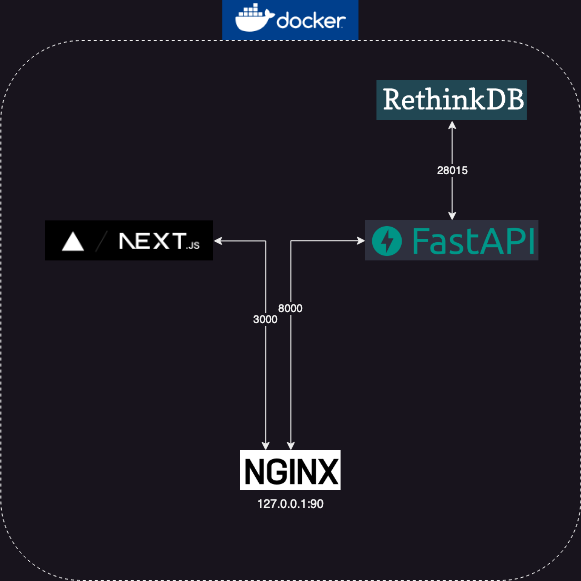

Security Group Console uses rethinkdb for the persistent layer. FastAPI for the backend and a next.js application for the frontend. Nginx fronts the whole thing. Everything is deployed with a docker-compose file. 

